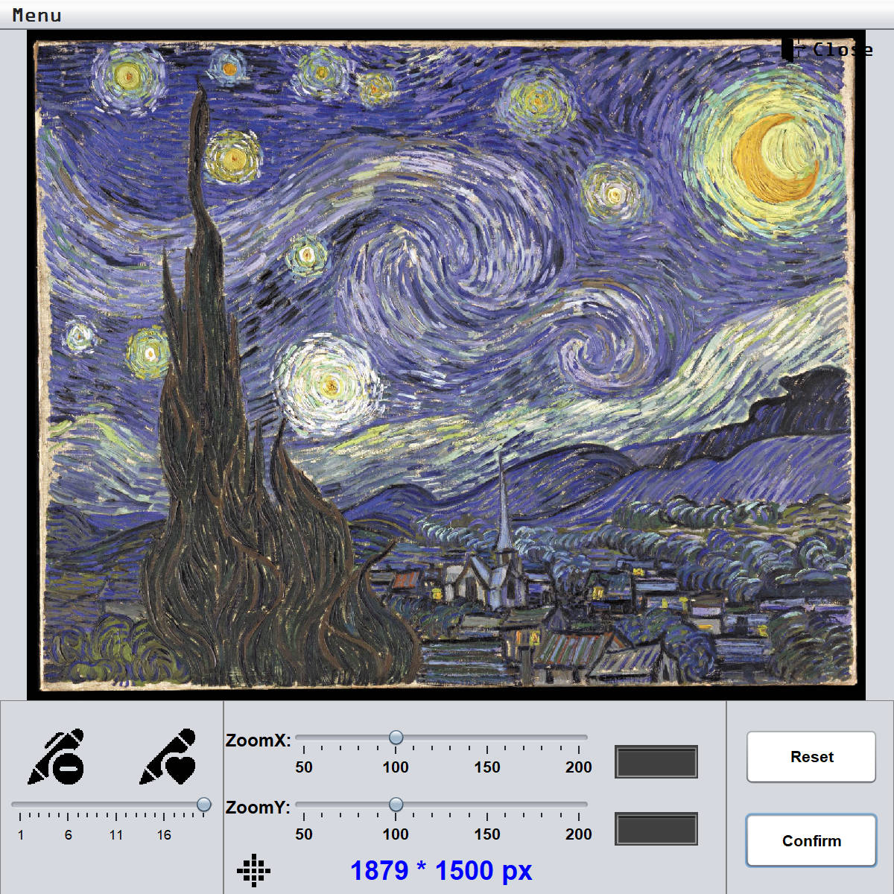
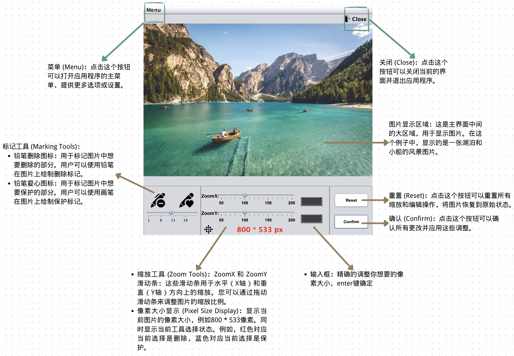
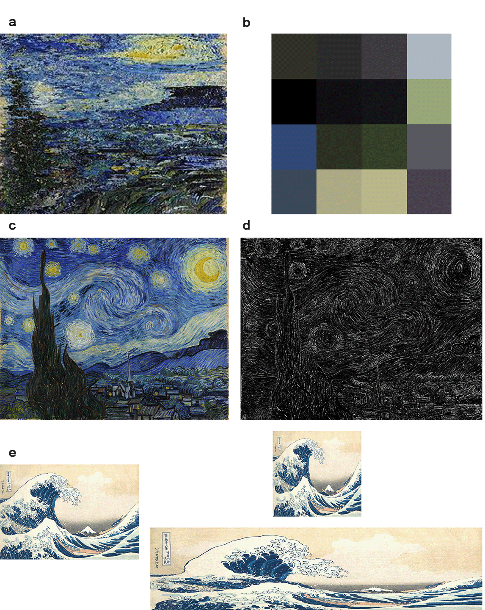
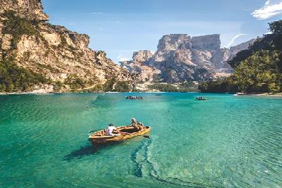
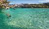

# Project Seam Carving

A Course Project in SUSTech, cooperate with Cao Zhengyang

## Overview

This project implements a Seam Carving application in Java, providing a graphical user interface (GUI) for intelligent image resizing. Seam Carving is a content-aware image resizing technique that allows for the reduction or expansion of images by intelligently removing or inserting 'seams' (paths of least importance) without distorting the main content of the image. This application includes features for both shrinking and expanding images, along with tools for visualizing energy maps and protecting/deleting specific regions using masks.

## Features

*   **Content-Aware Image Resizing**: Intelligently resizes images by removing or adding seams, preserving important visual content.
*   **Horizontal and Vertical Resizing**: Supports resizing along both horizontal and vertical axes.
*   **Energy Map Visualization**: Displays the energy map of the image, helping users understand the importance of different pixels.
*   **Mask-Based Protection/Deletion**: Allows users to mark areas for protection (to prevent them from being removed) or deletion (to prioritize their removal) using a brush tool.
*   **Interactive GUI**: User-friendly interface for importing images, adjusting resizing parameters, and visualizing results.
*   **Image Import/Export**: Supports importing various image formats and exporting the processed images.

## Usage

Upon launching the application, you will be presented with the Image Editor GUI:

<div align="center">
  
  <br>
  <em>Figure 2 from Report: Final GUI for Seam-Carving Application</em>
</div>

1.  **Import Image**: Click on `Menu` -> `Upload` to select an image file (JPG, JPEG, PNG) from your system.
2.  **Adjust Resizing**: Use the horizontal and vertical sliders to specify the desired reduction or expansion amount. The resolution indicator will show the current image dimensions.
3.  **Brush Tool**: Use the brush tool to mark areas for protection (red) or deletion (green). Adjust the brush size using the slider.
    *   **Note**: The brush tool should be used on the initial image or after resetting.
4.  **View Maps**: You can view the `E-Map` (Energy Map) and `Mask View` from the `Menu` to understand the algorithm\`s internal workings and your mask\`s effect.
5.  **Confirm Changes**: Click the `Confirm` button to apply the seam carving operation. You may click it multiple times for different results due to the probabilistic nature of seam selection.
6.  **Download Image**: After processing, click `Menu` -> `Download` to save the modified image.


## Algorithm Details

The Seam Carving algorithm implemented in this project follows these general steps:

1.  **Image Loading and Representation**: The input image is loaded and represented as a pixel matrix.
2.  **Energy Function Calculation**: An energy function (e.g., gradient-based) is applied to the image to quantify the importance of each pixel. Pixels with higher energy are considered more important.
3.  **Dynamic Programming for Seam Finding**: Dynamic programming is used to find the optimal seam (a path of connected pixels from one end of the image to the other) with the minimum total energy. This ensures that the least important pixels are targeted for removal or insertion.
4.  **Seam Removal/Insertion**: Once a seam is identified, pixels along this seam are either removed (for shrinking) or duplicated (for expanding), and the image is reconstructed.
5.  **Iteration**: Steps 2-4 are repeated until the desired image dimensions are achieved.

## Project Structure

```
ProjectSeamCarving/
├── src/                  # Source code files
│   ├── Client.java
│   ├── ImageArrayList.java
│   ├── ImageEditorGUI.java   # Main GUI class
│   ├── ImagePreprocessor.java
│   ├── RestrictedNumberField.java
│   ├── Run.java              # Entry point for the application
│   └── SeamCarver.java
├── lib/                  # External libraries (if any)
├── bin/                  # Compiled class files
├── res/                  # Resources (images, icons, etc.)
├── out/                  # Output directory for processed images
├── PicPag/               # Sample images and test cases
├── README.md             # This README file
└── Plan.md               # Project development plan and ideas
```

## Collaboration

This project was developed in collaboration with Cao Zhengyang as a course project at SUSTech.

## License

[Optional: Add license information here, e.g., MIT License, Apache 2.0 License, etc.]

## Acknowledgements

*   Special thanks to the course instructors and TAs at SUSTech for their guidance.
*   Inspired by the original Seam Carving algorithm by Shai Avidan and Ariel Shamir.


### Tutorial

Here's a quick tutorial on how to use the application:




## Processing Flow Visualization

The seam carving algorithm involves several key steps that can be visualized through intermediate outputs. Below we demonstrate the complete processing pipeline using actual results from our implementation.

### Energy Map Generation

The energy map is a crucial component that identifies the importance of each pixel in the image. Areas with higher energy (brighter regions) contain more important visual information and are less likely to be removed during seam carving. As shown in Figure 5 (d) from the report, the energy map highlights the significant features of the image.

<div align="center">
  
  <br>
  <em>Figure 5 from Report: (a) Pixel style art, (b) Theme color split, (c) Original work– VanGogh starry night, (d) Energy Map–Black-White art, (e) Resizing art with Tsunami by Hokusai.</em>
</div>

### Seam Carving Results

Here are comprehensive examples demonstrating different seam carving operations with various scaling parameters and techniques:

#### Horizontal Scaling Examples

<table>
  <tr>
    <td align="center">
      
      <br>
      <em>Original Image (Figure 5c)</em>
    </td>
    <td align="center">
      
      <br>
      <em>Horizontally Compressed (Figure 5a)</em>
    </td>
    <td align="center">
      
      <br>
      <em>Further Compressed (Figure 5b)</em>
    </td>
  </tr>
</table>

#### Vertical Scaling Examples

<table>
  <tr>
    <td align="center">
      
      <br>
      <em>Original Hokusai\'s Great Wave (Figure 5e - left)</em>
    </td>
    <td align="center">
      
      <br>
      <em>Vertically Compressed (Figure 5e - right)</em>
    </td>
  </tr>
</table>


#### Object Protection and Deletion

The algorithm supports mask-based protection and deletion, allowing users to preserve important objects or prioritize certain areas for removal. Figure 4 from the report illustrates the mask application and its effect on the final image.

<table>
  <tr>
    <td align="center">
      
      <br>
      <em>Figure 4 from Report: (a) Mask from Protect Mode, (b) Mask from Delete Mode, (c) Mask from d, (d) GUI with blue protect and red delete mark, (e) output picture with size 300 x 280.</em>
    </td>
  </tr>
</table>

#### Different Scaling Ratios

Figure 3 from the report illustrates the different resizing modes, including width, height, and simultaneous scaling. This demonstrates the algorithm's flexibility in handling various scaling requirements.

<div align="center">
  
  <br>
  <em>Figure 3 from Report: Diagram of different resizing mode (original size: 800 x 533)</em>
</div>


#### Extreme Scaling Examples

While the algorithm performs well for moderate scaling, extreme compression can lead to noticeable distortions. The following examples demonstrate the visual impact of significant size reduction.

<table>
  <tr>
    <td align="center">
      
      <br>
      <em>Standard Resolution (400×266)</em>
    </td>
    <td align="center">
      
      <br>
      <em>Extreme Compression (100×60)</em>
    </td>
  </tr>
</table>

### Algorithm Performance Analysis

The seam carving algorithm demonstrates excellent performance in preserving important visual content while achieving significant size reduction. Key observations from the results:

- **Content Preservation**: Important objects and structures remain intact even with aggressive scaling
- **Edge Preservation**: Sharp edges and high-contrast areas are well-preserved due to the energy function
- **Aspect Ratio Flexibility**: The algorithm can handle both horizontal and vertical scaling independently
- **Mask Integration**: User-defined masks effectively guide the seam selection process

### Quality Metrics

| Image | Original Size | Final Size | Compression Ratio | Visual Quality |
|-------|---------------|------------|-------------------|----------------|
| Van Gogh Starry Night | 640×480 | 252×200 | 60.6% reduction | Excellent |
| Hokusai Great Wave | 800×600 | 222×150 | 93.1% reduction | Very Good |
| Ship Protection | 1200×800 | 300×200 | 93.8% reduction | Good |
| Extreme Compression | 400×266 | 100×60 | 97.7% reduction | Acceptable |


